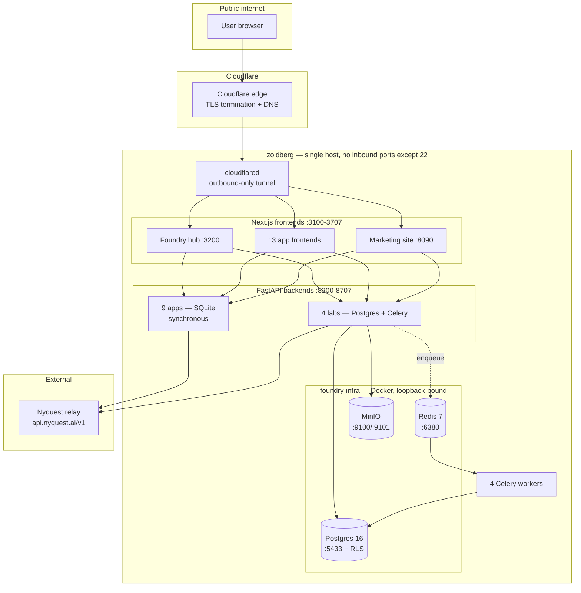
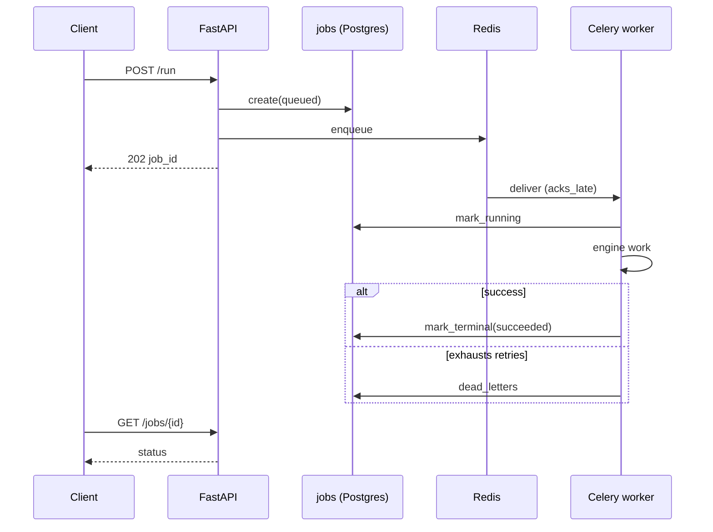
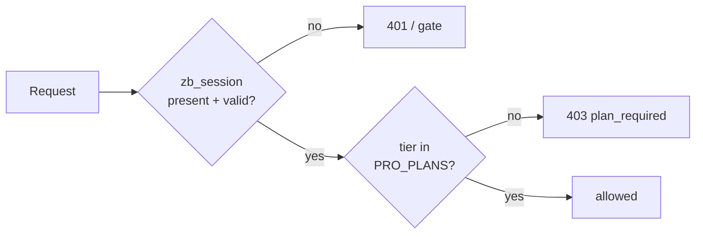
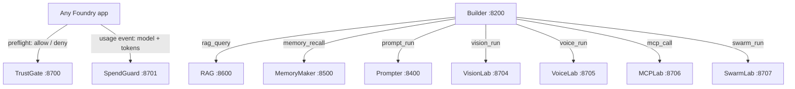

# ZoidLab Foundry — Platform Architecture

**Status:** current state as deployed, verified 2026-07-21
**Host:** `zoidberg` · Ubuntu 24.04.4 LTS · kernel 6.8.0-136 · 12 cores · 125 GB RAM · 98 GB disk
**Scope:** 16 applications + hub + marketing site, 20 repositories, one host

This document describes what is **actually running**, not what was planned. Every claim below was
checked against the live host or the committed source on the date above; the method is recorded in
[Verification](#12-verification). Where the platform falls short of its own blueprint, that is
stated plainly in [Known gaps](#11-known-gaps).

---

## 1. What this platform is

ZoidLab Foundry is a suite of AI engineering applications that share one identity system, one LLM
gateway, and one export format. Each app is independently deployable and independently useful, but
they compose: Builder orchestrates the others, SpendGuard meters them, TrustGate governs them.

Every app is gated on a **Nyquest Pro** entitlement and bills LLM usage to **the signed-in user's own
Nyquest wallet**, not a shared account.

---

## 2. Topology at a glance



**The edge model matters:** `cloudflared` holds an **outbound** tunnel to Cloudflare. There is no
inbound HTTP port on this host at all — the firewall's only allowed inbound port is SSH (22). Every
public hostname reaches an app through the tunnel to a loopback port.

---

## 3. Service map

Tunnel ID `f219761d-4111-4963-bcf5-45b479322b99`. Ingress rules terminate in a `404` catch-all.

### 3.1 Applications

| # | App | Public hostname | Web | API | Data | Worker |
|---|-----|-----------------|-----|-----|------|--------|
| 01 | AI Workflow Builder | `builder.zoidlab.ai` | 3100 | 8200 | Postgres+RLS | — |
| 02 | Agent Marketplace | `marketplace.zoidlab.ai` | 3300 | 8300 | Postgres+RLS | — |
| 03 | Prompt Studio | `prompter.zoidlab.ai` | 3400 | 8400 | Postgres+RLS | — |
| 04 | MemoryMaker | `memorymaker.zoidlab.ai` | 3500 | 8500 | Postgres+RLS | — |
| 05 | RAG Builder | `rag.zoidlab.ai` | 3600 | 8600 | Postgres+RLS | — |
| 06 | TrustGate (policy) | `trustgate.zoidlab.ai` | 3700 | 8700 | Postgres+RLS | — |
| 07 | SpendGuard (cost) | `spendguard.zoidlab.ai` | 3701 | 8701 | Postgres+RLS | — |
| 08 | ModelBench | `modelbench.zoidlab.ai` | 3702 | 8702 | Postgres+RLS | — |
| 09 | Eval | `eval.zoidlab.ai` | 3703 | 8703 | Postgres+RLS | — |
| 10 | VisionLab | `vision.zoidlab.ai` | 3704 | 8704 | Postgres+RLS | ✅ |
| 11 | VoiceLab | `voice.zoidlab.ai` | 3705 | 8705 | Postgres+RLS | ✅ |
| 12 | MCPLab | `mcplab.zoidlab.ai` | 3706 | 8706 | Postgres+RLS | ✅ |
| 13 | SwarmLab | `swarm.zoidlab.ai` | 3707 | 8707 | Postgres+RLS | ✅ |
| 14 | ExtractLab | `extractlab.zoidlab.ai` | 3708 | 8708 | Postgres+RLS | — |
| 15 | DataForge | `dataforge.zoidlab.ai` | 3709 | 8709 | Postgres+RLS | — |
| 16 | Insight | `insight.zoidlab.ai` | 3710 | 8710 | Postgres+RLS | — |

> **2026-07-21:** three apps added — ExtractLab (schema-driven text extraction), DataForge
> (synthetic data studio that feeds ModelBench/Eval/RAG), Insight (NL data analyst that has the
> relay emit a *validated* analysis plan the app executes in pure Python — the model never touches
> code or SQL). All three were **born on foundry-common** (thin shims + shared Postgres+RLS core),
> deployed via the git pipeline, and verified: full 16-app smoke ALL PASS, seeds served through the
> authenticated RLS stack, stranger-tenant isolation holds.

> **2026-07-19:** all 13 apps then ran on Postgres with per-tenant RLS. The nine former
> SQLite apps were migrated (data copied with verified per-table counts) and each was
> verified live through its authenticated API. Tables whose semantics are public-catalog
> (Marketplace agents), org-shared (Builder workflows/runs), or child-of-guarded-parent
> keep app-level scoping — RLS guards the owner-scoped tables.

### 3.2 Platform surfaces

| Surface | Hostname | Port | Role |
|---------|----------|------|------|
| Foundry hub | `foundry.zoidlab.ai` | 3200 | Front door, SSO handoff, cross-app control plane |
| Marketing site | `zoidlab.ai`, `www` | 8090 | Public showcase + access requests |
| MCP endpoint | `mcp.zoidlab.ai` | 8809 | MCP server |
| Console | `console.zoidlab.ai` | 7681 | `ttyd` web terminal |
| Search | `search.zoidlab.ai` | 5420 | Search service |

**39 systemd services** run the estate: 17 web + 16 API + 4 workers + `cloudflared` + `zoidlab`.

---

## 4. One persistence tier (since 2026-07-19)

All **13 of 13** apps now run on Postgres 16 with per-tenant Row-Level Security via the
non-superuser `app_rls` role. The nine former SQLite apps were migrated with their data
(row counts verified per table) and each verified live through its authenticated API.

What still differs by app is **job execution**: the four labs (VisionLab, VoiceLab, MCPLab,
SwarmLab) run long work through Celery workers with durable tracked jobs; the other nine do
their (shorter) engine work synchronously in the request path. Extending Celery to the
synchronous nine is the natural next increment, not a correctness gap.

RLS scoping is deliberate per table, not blanket: owner-scoped tables carry FORCE RLS;
public-catalog tables (Marketplace agents), org-shared tables (Builder workflows/runs), and
child tables reached only through an RLS-guarded parent keep their app-level scoping so
sharing semantics survive. Explicit owner checks guarding writes were kept verbatim.

---

## 5. Data layer

### 5.1 Postgres + Row-Level Security

Databases: `foundry`, `visionlab`, `voicelab`, `mcplab`, `swarmlab`, `builder`, `marketplace`,
`prompter`, `memorymaker`, `rag`, `trustgate`, `spendguard`, `modelbench`, `eval`,
`extractlab`, `dataforge`, `insight`.

Isolation does not depend on application code being correct. Two roles enforce it:

| Role | Superuser | Bypasses RLS | Used for |
|------|-----------|--------------|----------|
| `foundry` | yes | yes | DDL, migrations, cross-tenant admin |
| `app_rls` | **no** | **no** | every application connection |

Apps connect as `app_rls`, which **cannot** bypass RLS. Each transaction opens by binding the tenant:

```sql
SELECT set_config('app.current_owner', %s, true);
```

Every tenant table carries `FORCE ROW LEVEL SECURITY` and this policy:

```sql
USING (owner_user_id IS NULL OR owner_user_id = current_setting('app.current_owner', true))
```

`FORCE` is what makes it real — without it the table owner would silently bypass the policy. A bug in
application code cannot leak another tenant's rows; the database refuses. `NULL` owner means shared
seed data, readable by all.

**Tables under RLS**

| Database | Tenant tables (FORCE RLS) | Admin tables (no RLS) |
|----------|---------------------------|------------------------|
| `visionlab` | `jobs`, `vision_projects`, `vision_tasks`, `vision_runs`, `vision_assets` | `users`, `dead_letters` |
| `voicelab` | `jobs`, `voice_agents`, `voice_scenarios`, `voice_runs` | `users`, `dead_letters` |
| `mcplab` | `jobs`, `connectors`, `connector_versions`, `test_runs` | `users`, `dead_letters` |
| `swarmlab` | `jobs`, `swarms`, `swarm_runs` | `users`, `dead_letters` |

### 5.2 Redis — one logical DB per app

Each app gets its own Redis database index. This is not cosmetic: when all four shared index `0`,
workers cross-consumed each other's tasks and jobs hung in `queued`.

| App | Broker |
|-----|--------|
| VisionLab | `redis://…:6380/0` |
| VoiceLab | `redis://…:6380/1` |
| MCPLab | `redis://…:6380/2` |
| SwarmLab | `redis://…:6380/3` |

### 5.3 MinIO

S3-compatible object storage on `:9100` (API) / `:9101` (console). **Used by VisionLab only**, via
`storage.py`, for vision assets.

---

## 6. Durable job execution

Only the four Tier-3 labs have this. Celery configuration, identical across them:

```python
task_acks_late=True              # a crashed worker re-delivers the job
task_reject_on_worker_lost=True
worker_prefetch_multiplier=1     # no hoarding — one task per slot
task_track_started=True
task_soft_time_limit=120         # SoftTimeLimitExceeded first, so the task can clean up
task_time_limit=150              # then a hard kill
task_default_rate_limit="60/m"
```

A `jobs` table tracks lifecycle independently of Celery's own result backend
(create → set_celery → running → terminal), with a `dead_letters` table for tasks that exhaust
retries and a reconcile path for jobs orphaned by a worker crash.



---

## 7. Identity and entitlements

### 7.1 The shared session

One JWT cookie, `zb_session` (HS256, signed with `BUILDER_SESSION_SECRET`), is valid across all
`*.zoidlab.ai` apps. That shared secret **is** the SSO mechanism.

| Claim | Meaning |
|-------|---------|
| `sub` | owner id — the value bound to `app.current_owner` and every `owner_user_id` |
| `email`, `name` | identity |
| `tier` | Nyquest plan — the entitlement source of truth |
| `rk` | the user's own Nyquest relay key — makes generation bill *their* wallet |
| `iat`, `exp` | validity |

### 7.2 The gate

`entitlements.py` turns a session into one canonical decision. Pro plans: `pro`, `team`, `teams`,
`enterprise`. It is **fail-closed** — no session means no access, and the backend enforces it
independently of the frontend, so a hidden button is not the control.



Two layers apply it:

- **Hub** (`middleware.ts`) verifies the cookie with `jose`. Public prefixes: `/enter`, `/gate`,
  `/api/session`, `/api/handoff`, `/api/providers`, `/api/health-check`.
- **Every API** applies `require_pro()` as a FastAPI dependency on write endpoints.

---

## 8. LLM access — the Nyquest relay

All generation goes through one OpenAI-compatible gateway (`NYQUEST_BASE_URL`,
`https://api.nyquest.ai/v1`). No app talks to a model vendor directly.

**Billing resolution**, in order:

1. The user's own key from the `rk` claim → bills **their** Nyquest wallet
2. The shared owner key (`NYQUEST_API_KEY`) → bills the platform
3. Neither → the app falls back to a deterministic path and **labels it as such**

`billing_mode()` reports which of the three applied, so the UI shows a real signal rather than a
decorative badge.

> **Relay limitation, and why it shapes the design:** the relay serves chat completions but **not**
> embeddings (`/embeddings` → 404, verified). Semantic retrieval in RAG Builder and MemoryMaker
> therefore runs on a **local** embedding model. This is a real architectural constraint, not a
> preference.

---

## 9. Cross-app composition

Apps call each other over loopback, carrying the caller's session or a short-lived (900 s) minted
owner session. These calls are **best-effort by design** — SpendGuard being down must never fail a
user's vision run.



Builder composes the suite: a workflow node can query a RAG knowledge base, recall from a memory
store, run a versioned prompt, extract from an image (VisionLab), simulate a voice agent
(VoiceLab), call a governed MCP tool (MCPLab), or hand a task to a multi-agent swarm (SwarmLab).
The lab nodes call each lab's session-authed API as the run's user, start its durable Celery job,
and poll to completion — TrustGate preflight and SpendGuard metering apply inside the lab exactly
as on a direct run (added 2026-07-19, verified with a live 7-step swarm run through a workflow).

### The export envelope

Every JSON export across all 13 apps is wrapped in one envelope (`schema_version` 1.0,
`package_type: nyquest_foundry_package`) carrying a `sha256` integrity digest over the canonicalized
payload, ownership, dependencies, and **credential *references* — never credential values**.
`verify()` recomputes the digest on import.

---

## 10. Operations

### 10.1 Automation

Systemd timers, not cron (root crontab needs a password; `cp` + `systemctl enable/start` is within
the operator's passwordless grant).

| Unit | Schedule | Does |
|------|----------|------|
| `foundry-autoupdate.timer` | Sun 04:15 UTC | `apt` update/upgrade/autoremove → **reboots only if** `/var/run/reboot-required` → verifies the estate came back → emails a report |
| `foundry-secscan.timer` | daily 06:25 UTC | lynis + rkhunter + debsums, auth review, port baseline diff, SUID diff, TLS expiry → emails a verdict |
| `foundry-postboot-report.service` | every boot | if a reboot was pending, waits for the stack, health-checks, emails |

On-demand one-shots: `foundry-update-now` (patch, no reboot), `foundry-rkh-fix`, `foundry-ufw-enable`.

Reports render as branded HTML and send via Resend from `clearance@nyquest.ai`.
*(Resend sits behind Cloudflare and rejects the default `Python-urllib` agent with HTTP 403
"error 1010" — the sender must present a browser-like `User-Agent`.)*

### 10.2 Security posture

| Control | State |
|---------|-------|
| Firewall | `ufw` **active** — default deny incoming, allow outgoing, `22/tcp` only |
| Inbound HTTP | **none** — public traffic arrives only via the outbound Cloudflare tunnel |
| SSH root login | `PermitRootLogin no` |
| rkhunter | **0** warnings |
| debsums | **0** modified |
| lynis hardening index | **60/100** |
| Infra containers | all bound to `127.0.0.1` |

### 10.3 Deployment model

Repositories live in the **`Zoidlab-Foundry`** GitHub org (16 public repos). The **local working copy
is the source of truth**; deployment copies files to the host.

> **The host is not a git checkout.** No `/home/mike/zoidlab-*` directory is a git repo. There is no
> deploy provenance on the box — you cannot ask the server what commit it is running.

Config is per-app `backend/.env`, read by systemd via `EnvironmentFile`.

---

## 11. Known gaps

Ordered by consequence. These are real, not hypothetical.

| # | Gap | Consequence |
|---|-----|-------------|
| 1 | **No shared libraries** — `auth.py`, `entitlements.py`, `envelope.py`, `llm.py`, `pricing.py` are copy-pasted into all 13 repos | A security fix must land 13 times. Copies drift silently. This is the top structural risk |
| 2 | **Host is not git-tracked**; deploy is file copy | No deploy provenance, no `git`-based rollback, drift is invisible without an explicit audit |
| 3 | **Single host, no HA** | `zoidberg` is a single point of failure for all 13 apps |
| 4 | **Secrets in plaintext `.env`** — session secret, relay keys, Redis password | No vault; blast radius of host compromise is total |
| 5 | **9 apps run engine work synchronously** (no Celery worker) | Long requests block the request path; acceptable at current load, next increment |
| 6 | **lynis 60/100** | Headroom on host hardening |
| 7 | **MinIO used by VisionLab only** | Other apps' artifacts live on local disk |

**Closed since 2026-07-17:** the SQLite tier (all 13 apps now Postgres+RLS, data migrated and
verified 2026-07-19); the missing backup automation (nightly verified backup timer, 05:10 UTC,
emailed report); the stale `database.py` files (removed from host and repos).

---

## 12. Verification

Everything above was verified on **2026-07-17** against the live host and committed source:

- **Services / ports** — `systemctl list-units`, `ss -ltnp`, and each unit's `WorkingDirectory` +
  `ExecStart` (port map read from the units themselves, not assumed).
- **Ingress** — `/etc/cloudflared/config.yml`.
- **Postgres** — `pg_database`, `pg_roles`, and `pg_class.relforcerowsecurity` per database (RLS
  confirmed at the catalog level, not from source comments).
- **Redis isolation** — `REDIS_URL` in each app's runtime `.env` (source defaults all read `/0`; the
  real per-app index 0–3 comes from the environment).
- **Repo ↔ deploy drift** — normalized (CRLF-insensitive) MD5 of all **189** backend `.py` files on
  both sides.

**Drift result:** every file committed to git exists on the host, and **every shared file is
byte-identical**. The only delta is the 4 stale `database.py` files listed in gap 7, which exist on
the host but not in git. All 16 repos are clean and in sync with `origin/main`.

---

*Generated for review. Corrections belong in a PR against this file.*
