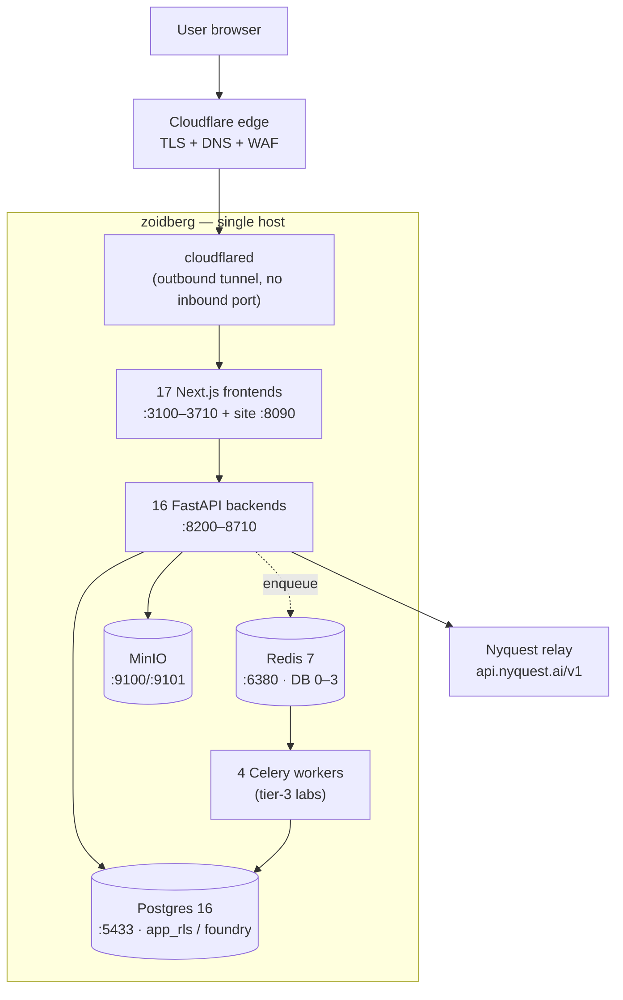
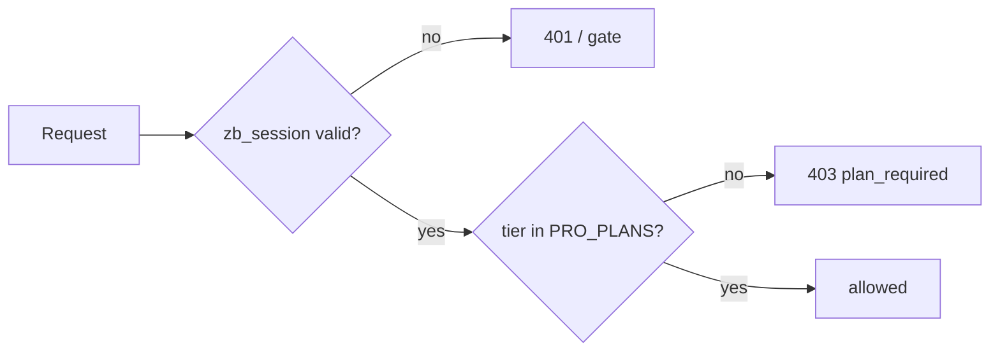
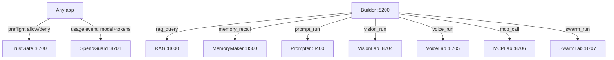

# ZoidLab Foundry — Design & Architecture Reference

**Definitive design document. Verified live against `zoidberg` on 2026-07-25.**
This is the rework-grade reference: it describes what is *actually running* and *why it is shaped
that way*, so the platform can be evolved deliberately. For the short current-state summary see
[ARCHITECTURE.md](ARCHITECTURE.md); for recovery procedures see [RUNBOOK.md](RUNBOOK.md).

---

## 0. How to use this document

- **Sections 1–4** are the mental model: what the platform is, its principles, and its topology.
- **Section 5 (Application anatomy)** is the most important for reworking — it is the single shape
  every app follows. Change the shape here and you change all 16 apps.
- **Sections 6–12** are the horizontal systems (shared library, data, identity, LLM, jobs, composition).
- **Sections 13–16** are delivery, operations, security, and disaster recovery.
- **Sections 17–19** are reference material (repos, per-app detail, conventions).
- **Sections 20–21** are the honest gap list and the ranked roadmap for where to take it next.

---

## 1. What the platform is

ZoidLab Foundry is a suite of **16 AI-engineering web applications** plus a hub and a marketing
site, all built on the **Nyquest** LLM relay and sharing one identity system, one billing model,
and one export format. Each app is independently deployable and independently useful, but they
**compose**: Builder orchestrates the others, SpendGuard meters them, TrustGate governs them,
DataForge feeds them.

Every app is gated on a **Nyquest Pro** entitlement and bills LLM usage to **the signed-in user's
own Nyquest wallet**, not a shared account.

### Platform at a glance (verified 2026-07-25)

| Dimension | Value |
|-----------|-------|
| Applications | 16 (all Postgres + per-tenant RLS) |
| Hub + marketing | Foundry hub + zoidlab.ai |
| Repositories | 20 (`Zoidlab-Foundry` GitHub org) |
| Host | `zoidberg` — Ubuntu 24.04.4, kernel 6.8.0-136, 12 cores, 125 GB RAM, 98 GB disk (46% used) |
| Running app services | 37 (16 API + 17 web + 4 workers) + `cloudflared` + `zoidlab` site |
| Databases | 17 app DBs on Postgres 16.14 |
| Infra | Postgres 16.14, Redis 7.4.9, MinIO — Docker, loopback-only |
| Runtime | Python 3.12.3 (FastAPI), Node v22.23.1 (Next.js 15 / React 19) |
| Shared library | `foundry-common` v0.1.1 (9 apps adopted) |
| Load at capture | 0.14 on 12 cores, 4.8 GB RAM used — the box is ~96% idle |

---

## 2. Design principles

These are the invariants. A rework should keep them or change them consciously.

1. **One shared shape.** Every app is FastAPI + Postgres/RLS backend + Next.js frontend, gated on
   the same session, billing the same relay. New apps are born from the template, not from scratch.
2. **The database enforces tenancy, not the app.** Row-Level Security means a bug in application
   code cannot leak another tenant's data. This is non-negotiable and load-bearing.
3. **Bill the user, not the platform.** Generation uses the signed-in user's own relay key; the
   app never silently spends the platform's money.
4. **Honest surfaces.** No fabricated metrics, no cosmetic gates, no "signed" where it isn't signed.
   Where something is mock/deterministic, it says so.
5. **Fail closed.** No session ⇒ no access. A missing secret disables a feature rather than running
   insecurely.
6. **Outbound-only edge.** No inbound HTTP port exists on the host; all public traffic arrives
   through an outbound Cloudflare tunnel.
7. **Auditable, reversible ops.** Deploys are git checkouts with printed provenance and health
   gates; every change can be rolled back to a sha.
8. **Verify, don't assert.** Backups are restore-drilled; deploys are smoke-gated; claims in docs
   are checked against the live host.

---

## 3. Physical topology



**The edge model is the security spine.** `cloudflared` holds an *outbound* tunnel to Cloudflare.
There is **no inbound HTTP port** on this host — the firewall's only allowed inbound port is SSH (22).
Every public hostname reaches an app through the tunnel to a **loopback** port. Nothing on
`3100–8710`, Postgres, Redis, or MinIO is reachable from the network.

---

## 4. Service & port map

Tunnel ID `f219761d-4111-4963-bcf5-45b479322b99`. 22 ingress hostnames terminate in a `404` catch-all.

### 4.1 Applications (16)

| # | App | Hostname | Web | API | DB | Worker | Package |
|---|-----|----------|-----|-----|----|----|---------|
| 1 | **Builder** (AI Workflow Builder) | builder.zoidlab.ai | 3100 | 8200 | builder | — | 01 |
| 2 | **Marketplace** (Agent store) | marketplace.zoidlab.ai | 3300 | 8300 | marketplace | — | — |
| 3 | **Prompter** (Prompt Studio) | prompter.zoidlab.ai | 3400 | 8400 | prompter | — | — |
| 4 | **MemoryMaker** (AI Memory Studio) | memorymaker.zoidlab.ai | 3500 | 8500 | memorymaker | — | — |
| 5 | **RAG Builder** | rag.zoidlab.ai | 3600 | 8600 | rag | — | 05 |
| 6 | **TrustGate** (Policy Engine) | trustgate.zoidlab.ai | 3700 | 8700 | trustgate | — | 06 |
| 7 | **SpendGuard** (Cost Optimizer) | spendguard.zoidlab.ai | 3701 | 8701 | spendguard | — | 07 |
| 8 | **ModelBench** (Benchmark Lab) | modelbench.zoidlab.ai | 3702 | 8702 | modelbench | — | 08 |
| 9 | **Eval** (Evaluation Lab) | eval.zoidlab.ai | 3703 | 8703 | eval | — | 09 |
| 10 | **VisionLab** | vision.zoidlab.ai | 3704 | 8704 | visionlab | ✅ | 10 |
| 11 | **VoiceLab** | voice.zoidlab.ai | 3705 | 8705 | voicelab | ✅ | 11 |
| 12 | **MCPLab** | mcplab.zoidlab.ai | 3706 | 8706 | mcplab | ✅ | 12 |
| 13 | **SwarmLab** | swarm.zoidlab.ai | 3707 | 8707 | swarmlab | ✅ | 13 |
| 14 | **ExtractLab** (text→JSON) | extractlab.zoidlab.ai | 3708 | 8708 | extractlab | — | 14 |
| 15 | **DataForge** (synthetic data) | dataforge.zoidlab.ai | 3709 | 8709 | dataforge | — | 15 |
| 16 | **Insight** (NL data analyst) | insight.zoidlab.ai | 3710 | 8710 | insight | — | 16 |

### 4.2 Platform surfaces & auxiliary

| Surface | Hostname | Port | Role |
|---------|----------|------|------|
| Foundry hub | foundry.zoidlab.ai | 3200 | Front door, SSO handoff, cross-app control plane |
| Marketing site | zoidlab.ai / www | 8090 | Public showcase (Astro) + access requests |
| MCP endpoint | mcp.zoidlab.ai | 8809 | MCP server |
| Console | console.zoidlab.ai | 7681 | `ttyd` web terminal |
| Search | search.zoidlab.ai | 5420 | Search service |
| Postgres | — | 5433 | 127.0.0.1 only |
| Redis | — | 6380 | 127.0.0.1 only |
| MinIO | — | 9100 / 9101 | 127.0.0.1 only (API / console) |

### 4.3 systemd unit naming

- App API: `<app>-api.service` (WorkingDirectory `…/backend`, `uvicorn main:app --port <api>`)
  — exceptions: Builder is `zoidlab-builder-api`, RAG is `rag-api`.
- App web: `<app>-web.service` (`next start -p <web>`) — Builder `zoidlab-builder-web`,
  hub `zoidlab-foundry-web`.
- Workers: `<app>-worker.service` (Celery) — VisionLab, VoiceLab, MCPLab, SwarmLab only.
- Site: `zoidlab.service` (Node server on 8090).

---

## 5. Application anatomy (the shared shape) — **start here to rework**

Every app follows this exact structure. This is the template; changing it is a platform-wide change.

```
zoidlab-<app>/
├── backend/                      FastAPI (Python 3.12)
│   ├── main.py                   routes; FastAPI lifespan → db.init() + seed on startup
│   ├── db_pg.py                  Postgres+RLS data layer (make_pool / _tx / apply_rls)
│   ├── auth.py                   shim → foundry_common.auth      (session, require_pro, relay_key)
│   ├── entitlements.py           shim → foundry_common.entitlements  (Pro decision; sometimes local variant)
│   ├── envelope.py               shim → foundry_common.envelope  (signed export wrapper)
│   ├── llm.py                    shim → foundry_common.llm        (Nyquest relay client)
│   ├── pricing.py                shim → foundry_common.pricing    (model price table; sometimes local)
│   ├── <engine>.py               the app's real work (extraction_engine / benchmark_engine / …)
│   ├── seed_*.py                 owner-NULL seed data (shared via RLS policy)
│   ├── exporter.py               builds the export payload
│   ├── requirements.txt          pins foundry-common @ git tag + fastapi/uvicorn/httpx/pydantic/PyJWT
│   ├── .env                      secrets + DSNs (chmod 600, NOT in git)
│   └── .venv/                    per-app virtualenv
├── frontend/                     Next.js 15 / React 19 / Tailwind
│   ├── app/                      pages (dashboard, feature pages, /enter, /upgrade, SSO routes)
│   ├── components/               <App>Nav, FoundryAccessGate, ProRequiredScreen, HelpGuide
│   ├── lib/                      api.ts (fetch), useUser.ts, handoff.ts (SSO), subscription.ts
│   ├── middleware.ts             verifies zb_session; public prefixes bypass
│   ├── next.config.js            rewrites /api/* → http://127.0.0.1:<api-port>
│   └── .env                      BUILDER_SESSION_SECRET + PRO_TIERS (chmod 600)
├── .github/workflows/ci.yml      backend compileall + frontend next build
├── LICENSE (MIT) · CONTRIBUTING.md · Dockerfile(s) · docker-compose.yml
```

**Request path:** browser → Cloudflare → tunnel → Next.js (`:3xxx`) → `next.config.js` rewrite →
FastAPI (`:8xxx`) → `db_pg` (RLS-scoped) → Postgres. The frontend fetches **relative** `/api/*`
paths; the rewrite proxies them to the app's own backend, so the browser never talks to the API
directly and no CORS surface is exposed publicly.

**Startup:** each API's FastAPI `lifespan` calls `db.init()` (creates tables + RLS policies + grants)
then `seed_*.run()` (idempotent owner-NULL seed). A fresh clone becomes a working app on first boot.

**Every write endpoint** applies `require_pro` → resolves the owner → runs inside `_tx(owner)` so
RLS scopes it. **Read endpoints** run inside `_tx(viewer)` and let RLS filter — no manual
`WHERE owner=…`. Engine-internal writes with no owner in scope, and token-resolved deployed-endpoint
paths, use the admin (superuser) connection deliberately.

---

## 6. foundry-common — the shared platform layer

Repo `Zoidlab-Foundry/foundry-common`, currently **v0.1.1**, installed into each adopting app's venv
via a pinned git tag in `requirements.txt`.

| Module | Responsibility |
|--------|----------------|
| `auth` | Decode the `zb_session` cookie; `require_pro()` FastAPI dependency; `relay_key()` (the `rk` claim) |
| `entitlements` | Turn a session into the canonical Pro decision (fail-closed); `ALL_PACKAGES` list |
| `envelope` | The signed export envelope — `wrap()` / `verify()` with a sha256 integrity digest |
| `llm` | Nyquest relay client — `chat()`, `set_relay_auth()`, `billing_mode()`, `available()` |
| `pricing` | Model price table + measured-cost helpers |
| `db` | Postgres+RLS core: `make_pool()`, `make_tx()`, `admin_connect()`, `apply_rls()`, `fork_safe()` |

**Adoption map (deliberate, not blanket):** modules that matched the canonical base became
three-line shims (`from foundry_common.X import *`); genuine variants stay local.

- **Shimmed:** Eval (5/5), ModelBench (4), SpendGuard (4), TrustGate (3), VisionLab/VoiceLab/
  MCPLab/SwarmLab (3 each), RAG (1) — ~25 duplicate modules eliminated.
- **Kept local by design:** Builder, Prompter, Marketplace, MemoryMaker (variant auth gates,
  variant `llm` surfaces, per-app `entitlements.ALL_PACKAGES`, cost-engine `pricing`), plus each
  lab's `auth`+`entitlements` pair (bound via the underscore-private `_mock_session`).

**Why it matters for reworking:** a change to session handling, entitlements, the relay client, or
the export envelope now lands in one place and ships to 9 apps with a tag bump + redeploy. The 4
non-adopters and each lab's local pair are the deliberate exceptions to check when changing auth.

**The `db.fork_safe()` gotcha:** Celery pre-forks workers; a Postgres pool opened at import breaks
on fork. Each worker's `celery_app.py` recreates its pool in a `worker_process_init` hook. This was
a real production bug (all lab jobs stuck `queued`) — keep it.

---

## 7. Data architecture

### 7.1 Postgres 16 + Row-Level Security

**17 databases**, one per app (`builder`, `marketplace`, `prompter`, `memorymaker`, `rag`,
`trustgate`, `spendguard`, `modelbench`, `eval`, `visionlab`, `voicelab`, `mcplab`, `swarmlab`,
`extractlab`, `dataforge`, `insight`, + `foundry`).

**Two roles enforce isolation — this is the core of the tenancy model:**

| Role | Superuser | Bypasses RLS | Used by |
|------|-----------|--------------|---------|
| `foundry` | yes | yes | DDL, migrations, cross-tenant admin, engine-internal writes |
| `app_rls` | **no** | **no** | **every application connection** |

Apps connect as `app_rls`, which *cannot* bypass RLS. Each transaction binds the tenant:

```sql
SELECT set_config('app.current_owner', %s, true);   -- per transaction, inside _tx(owner)
```

Every **tenant table** carries `FORCE ROW LEVEL SECURITY` and this policy:

```sql
USING      (owner_user_id IS NULL OR owner_user_id = current_setting('app.current_owner', true))
WITH CHECK (owner_user_id IS NULL OR owner_user_id = current_setting('app.current_owner', true))
```

`FORCE` is load-bearing — without it the table owner silently bypasses the policy. `NULL` owner =
shared seed, readable by all tenants. Proven: a stranger tenant sees **0** owned rows in every DB.

**Not every table is RLS'd — by design.** Un-policied tables are those reached only through an
RLS-guarded parent, or with intentionally public/shared semantics:
- `users`, `dead_letters` everywhere (no owner column).
- Marketplace `agents` (public catalog), Builder `workflows`/`runs` (org-shared via app-level
  `_access`), child tables (chunks under a KB, versions under a prompt).
- Example: VisionLab has 5 FORCE-RLS tables of 7 (`users` + `dead_letters` open).

**`db_pg.py` primitives** (from `foundry_common.db` where adopted):
- `make_pool(dbname)` → `psycopg_pool.ConnectionPool` as `app_rls`.
- `_tx(owner)` context manager → sets `app.current_owner`, commits/rolls back, returns to pool.
- `admin_connect(dbname)` → superuser connection for DDL + cross-tenant work.
- `apply_rls(conn, tenant_tables)` → ENABLE+FORCE RLS + policy + grants to `app_rls`, called in `init()`.

### 7.2 Redis 7 — Celery broker with per-app DB isolation

Only the four tier-3 labs use Redis (Celery broker + result backend). **Each app gets its own Redis
DB index** — this is not cosmetic: when all four shared index 0, workers cross-consumed each other's
tasks and jobs hung. VisionLab `/0`, VoiceLab `/1`, MCPLab `/2`, SwarmLab `/3`.

### 7.3 MinIO — object storage

S3-compatible, `:9100` (API) / `:9101` (console). **Used by VisionLab only** (`storage.py`, vision
assets). Other file-bearing apps (RAG documents, VoiceLab audio) still use local disk — see gaps.

---

## 8. Identity & access

### 8.1 The shared session (`zb_session`)

One JWT cookie, HS256-signed with `BUILDER_SESSION_SECRET`, valid across all `*.zoidlab.ai` apps.
**The shared secret *is* the SSO mechanism.**

| Claim | Meaning |
|-------|---------|
| `sub` | owner id — bound to `app.current_owner` and every `owner_user_id` |
| `email`, `name` | identity |
| `tier` | Nyquest plan — the entitlement source of truth |
| `rk` | the user's own Nyquest relay key — makes generation bill *their* wallet |
| `iat`, `exp` | validity (handoff-minted sessions are short, e.g. 900 s) |

Minted by the SSO handoff from `app.nyquest.ai`; unattended runs (webhook/schedule) mint a
short-lived owner session with the same secret.

### 8.2 Entitlements — the Pro gate (fail-closed)

`entitlements.py` turns a session into one canonical decision. Pro plans: `pro`, `team`, `teams`,
`enterprise`. No session ⇒ no access. Enforced at **two layers**:
- **Hub middleware** (`middleware.ts`, `jose`) — public prefixes `/enter`, `/gate`, `/api/session`,
  `/api/handoff`, `/api/providers`, `/api/health-check`.
- **Every API** — `require_pro()` FastAPI dependency on write endpoints, independent of the frontend
  gate (a hidden button is not the control).



---

## 9. LLM relay & per-user billing

All generation goes through one OpenAI-compatible gateway (`NYQUEST_BASE_URL`,
`https://api.nyquest.ai/v1`). No app talks to a model vendor directly.

**Billing resolution order** (`llm.billing_mode()` reports which applied):
1. The user's own key from the `rk` claim → bills **their** Nyquest wallet.
2. The shared owner key (`NYQUEST_API_KEY`) → bills the platform.
3. Neither → the app falls back to a deterministic path and **labels it as such**.

> **Relay limitation that shapes the design:** the relay serves chat completions but **not**
> embeddings (`/embeddings` → 404). Semantic retrieval in RAG and MemoryMaker therefore runs on a
> **local** embedding model, not the relay.

---

## 10. Job execution model — three tiers

This is where apps genuinely differ. Know which tier an app is in before changing its long ops.

| Tier | Mechanism | Apps | Durability |
|------|-----------|------|------------|
| **Durable** | Celery workers + Redis + `jobs` table + `dead_letters` | VisionLab, VoiceLab, MCPLab, SwarmLab | survives restart; ack-late redelivery; soft/hard time limits; retries+backoff |
| **In-process async** | FastAPI `BackgroundTasks` (returns immediately, frontend polls run status) | ModelBench, Eval | non-blocking, but a restart orphans a running job |
| **Synchronous** | work runs inline in the request | RAG (crawl/OCR/QA), MemoryMaker (ingest), DataForge (generate), ExtractLab, Insight, Builder, Prompter, Marketplace, TrustGate, SpendGuard | blocks the request; risk of gateway timeout on long jobs |

**Celery config (tier-3, identical across labs):** `task_acks_late`, `task_reject_on_worker_lost`,
`worker_prefetch_multiplier=1`, `task_soft_time_limit=120`, `task_time_limit=150`,
`task_default_rate_limit=60/m`. Lifecycle tracked in a `jobs` table independent of Celery's result
backend (create → running → succeeded/partial/failed/dead), with reconcile-on-restart.

**Rework note:** the highest-value async work is converting the *synchronous* long-job apps (RAG
crawl/OCR, MemoryMaker ingest, DataForge large generations). ModelBench/Eval already async. Doing it
right requires per-app **frontend** polling changes, so it's a scoped effort, not a drop-in.

---

## 11. Cross-app composition

Apps call each other over loopback, carrying the caller's session or a minted owner session. These
calls are **best-effort** — SpendGuard being down must never fail a user's run.



**Builder node catalog:** Start · Prompt · LLM · Decision · Switch · HTTP · Merge · Summarizer ·
Email · Variable · Model · TrustGate · **Foundry composition:** RAG Query · Memory Recall ·
Prompt Run · Vision Run · Voice Simulation · MCP Tool Call · Swarm Run. The lab nodes start the
lab's durable job as the run's user and poll to completion; TrustGate preflight + SpendGuard
metering apply inside the lab as on a direct run.

**Deployed endpoints (token-authed, per-user billed APIs):** RAG (cited-QA), MemoryMaker (recall),
Prompter (prompt-run) — currently 3 of 16. The labs and the new apps do **not** yet expose token
APIs (see roadmap — highest leverage).

**The export envelope:** every JSON export across all 16 apps is wrapped in one envelope
(`schema_version` 1.0, `package_type: nyquest_foundry_package`) carrying a sha256 integrity digest
over the canonical payload, ownership, dependencies, and **credential *references* — never values**.
`verify()` recomputes the digest on import.

---

## 12. Deployment & release engineering

**Repositories are the source of truth. The host runs git clones.** Every `/home/mike/zoidlab-*`
dir (and the site + hub) is a shallow clone of its GitHub repo; runtime files (`.env`, `.venv`,
`node_modules`, `.next`, `data`) are excluded via `.git/info/exclude`.

**Deploy** (`foundry-ops/foundry-deploy.sh <dir> [ref] [--web]`):
1. `git fetch` + `checkout` the ref (default `origin/main`), printing **old → new sha** for provenance.
2. Restart the API (`--web` also rebuilds the Next.js frontend + restarts web).
3. Health-gate the API port.
4. **Post-deploy smoke gate** — re-runs the full estate smoke; aborts (exit 2 + rollback hint) on
   any regression. `FOUNDRY_DEPLOY_NOSMOKE=1` opts out.
5. **Rollback** = `foundry-deploy.sh <dir> <old-sha>`.

**New-app provisioning** (the recipe, `provision_app.sh` pattern): create DB + grant `app_rls`;
`backend/.env` by copying a sibling's and `sed`-swapping the DB name (secrets stay server-side);
`frontend/.env` from a sibling; `python -m venv` + `pip install -r requirements.txt` (pulls
foundry-common); `npm install && npm run build`; systemd `-api`/`-web` units from a sibling's,
sed'd for paths/ports; enable + start; health-gate. `next.config.js` defaults the API URL to the
app's own loopback port, so no per-app API_URL env is needed.

**DNS + ingress for a new hostname:** DNS CNAME via `cloudflared tunnel route dns <tunnel> <host>`
run **as mike** (user cert). Ingress rule via the root one-shot `foundry-cf-add.service` (inserts
before the `404` catch-all, `cloudflared tunnel ingress validate`, restart cloudflared) — because
`/etc/cloudflared` is root-owned and `sudo cp` there needs a password not in the passwordless set.

---

## 13. Operations & automation

All under `/home/mike/foundry-ops/`, all email `mike@256kmagic.com` via Resend (from
`clearance@nyquest.ai`; requires a browser-like `User-Agent` or Cloudflare returns 403/1010).

### 13.1 Timers

| Unit | Schedule | Does |
|------|----------|------|
| `foundry-watch.timer` | **every 5 min** | Health of 16 API + 17 web + 4 workers + infra; emails **only on state change** (up↔down). The "just broke" signal. |
| `foundry-backup.timer` | daily **05:10 UTC** | Verified pg (`-Fc`, pg_restore-checked) + sqlite (integrity-checked) + MinIO tar + sha256 manifest → local (14-day) **and Google Drive** (30-day). |
| `foundry-restore-drill.timer` | **Sat 06:00 UTC** | Pulls the latest set **from Drive**, restores into a throwaway DB, verifies table/row counts vs live, drops it. Proves recoverability. |
| `foundry-secscan.timer` | daily **06:25 UTC** | rkhunter + lynis + debsums, auth review, port baseline diff, SUID diff, TLS expiry → verdict OK/WARNINGS/CRITICAL. |
| `foundry-autoupdate.timer` | **Sun 04:15 UTC** | apt update/upgrade/autoremove; conditional reboot; post-boot verify + report. |

### 13.2 On-demand one-shots (root, triggered by `sudo systemctl start`)

`foundry-update-now` (patch, no reboot) · `foundry-cf-add` (add ingress) · `foundry-rkh-fix`
(rkhunter remediation) · `foundry-ufw-enable` (safe firewall enable) · `foundry-postboot-report`.

### 13.3 Manual tools

`foundry-smoke.sh` (45 checks: 16 API healths + 17 web heads + 9 authenticated RLS reads + workers +
infra) · `foundry-report.sh` (estate health) · `foundry-restore-drill.sh <db> drive|local`.

---

## 14. Security posture

| Control | State |
|---------|-------|
| Firewall | `ufw` active — default deny incoming, allow outgoing, **only `22/tcp`** |
| Inbound HTTP | **none** — public traffic only via the outbound Cloudflare tunnel |
| SSH root login | `PermitRootLogin no` (root has no authorized_keys) |
| Infra containers | all bound to `127.0.0.1` |
| Secrets on disk | 17 `.env` files, all **chmod 600**, backend dirs 750; **not** git-tracked; **not** in the backup set |
| rclone token | `~/.config/rclone/rclone.conf` chmod 600 (Google OAuth refresh token) |
| Integrity | rkhunter 0, debsums 0, SUID baseline-diffed daily |
| lynis hardening index | 60/100 (headroom) |
| Last audit | 2026-07-25 — no compromise indicators |

**Known residual:** secrets are plaintext-at-rest in `.env`. The exploitable leak vectors (git,
backups, world-read) are closed; full at-rest encryption is deferred deliberately (an on-host
encryption key doesn't defend against root compromise — see gaps/roadmap).

---

## 15. Backup & disaster recovery

- **Local:** `foundry-ops/backups/<stamp>/` — `pg/*.dump` (all 17 DBs, `-Fc`, pg_restore-verified),
  `sqlite/*.db` (integrity-checked), `minio-data.tar.gz`, `MANIFEST.sha256`. 14-day retention.
- **Off-site:** each set `rclone`-copied to `gdrive:zoidberg-foundry-backups/<stamp>/` (same Google
  account/token as hermes' `fin-backup`), file-count-verified, 30-day Drive retention.
- **Proven recoverable:** the weekly restore drill pulls from Drive and restores to a scratch DB
  (verified 14 tables / 177 rows for `rag`). A backup you have never restored is not a backup.
- **Rebuild procedure:** full step-by-step in [RUNBOOK.md](RUNBOOK.md) — fresh host → infra
  (`setup.sh` + `make_app_role.sh`) → rclone → restore all DBs + MinIO → clone apps + provision →
  restore cloudflared → `foundry-smoke.sh` = ALL PASS. RTO target: well under an hour.
- **RPO:** 24 h (nightly). **The single-host / no-HA posture is a deliberate choice** — the box is
  ~96% idle, so the risk is availability, not capacity; the answer is fast tested recovery, not HA.

---

## 16. Repository map (20 repos, `Zoidlab-Foundry` org)

| Repo | Role | Local path |
|------|------|-----------|
| `zoidlab-builder` … `zoidlab-insight` (16) | the apps | `D:\Claude Projects\zoidlab-<app>` |
| `zoidlab-foundry` | the hub | `D:\Claude Projects\zoidlab-foundry` |
| `zoidlab` | marketing site (`site/`) + access server (`server/`) | `D:\Claude Projects\zoidlab` |
| `foundry-common` | shared platform library | `D:\Claude Projects\foundry-common` |
| `foundry-infra` | Docker infra + `ops/` (all timers/scripts) + these docs | `D:\Claude Projects\foundry-infra` |

Server clones live at `/home/mike/<repo>`. **Windows note:** the local working copies use
`autocrlf=true`; the server clones are LF — content is identical, only line endings differ.

---

## 17. Per-app notes worth knowing

- **Builder** — the oldest and most complex: React Flow canvas, workflows/versions/runs/schedules/
  secrets-vault/orgs-RBAC/audit/cost-analytics, deploy-as-webhook. Kept fully local (variant
  `auth`/`llm`/`pricing`). Its `db.py` (not `db_pg.py`) is the module name.
- **Marketplace** — public catalog: `agents` is intentionally NOT RLS'd (all signed-in users see
  listings); owner checks guard writes.
- **RAG / MemoryMaker** — store embeddings as JSON-TEXT; semantic retrieval uses a *local* embedding
  model (relay has no embeddings). Deployed-endpoint token paths resolve token→owner then act as owner.
- **ModelBench / Eval** — real relay benchmark / LLM-judge runs; already async via `BackgroundTasks`.
- **Labs (Vision/Voice/MCP/Swarm)** — the only Celery/worker apps; each auth+entitlements pair kept
  local because auth references `entitlements._mock_session` and each has an app-specific `ALL_PACKAGES`.
- **Insight** — safety-by-design: the relay emits only a *validated analysis plan* (op/group_by/
  metric/filters/chart over known columns, whitelisted, limit ≤ 200); the app executes it in pure
  Python. The model never touches code or SQL. No pandas (keeps the venv light).
- **DataForge** — the producer that feeds ModelBench/Eval/RAG; exports carry `modelbench_import` /
  `eval_import` / `rag_qa_import` convenience shapes inside the envelope.

---

## 18. Conventions, invariants & gotchas (hard-won)

- **SSH to zoidberg:** use the alias `zoidberg` (its `~/.ssh/config` Host block supplies the key).
  `ssh mike@10.0.0.205` does **not** match the block, offers no key, and hangs on a password prompt.
  Add `-o BatchMode=yes` so auth failures fail fast. Git Bash key load fails — use **Windows OpenSSH
  (PowerShell)** for scp/ssh to zoidberg; the Bash tool's ssh silently fails to authenticate.
- **PowerShell → ssh quoting** mangles parens/pipes/quotes/Go-templates. Always write a script to a
  file and `scp` it, then `bash` it. `sed -i 's/\r$//'` on the server before running (CRLF).
- **root vs mike:** the ops timers run the scripts as **root**; the rclone config, venvs, and app
  files live in **mike's** home. Root-run tooling that reads mike's config must pass an explicit path
  (e.g. `rclone --config /home/mike/.config/rclone/rclone.conf`). A root-owned file in a shared
  location (`state/`) can block a later mike-run's redirect — use `mktemp` for per-run scratch.
- **sudo scope:** mike has NOPASSWD for `cp` into `/etc/systemd/system` + `systemctl enable/start/
  restart` + docker. **NOT** for `apt install`, `sudo cat/tail`, editing `/etc/cloudflared`, or
  `journalctl`. Root actions go through a systemd one-shot (cp unit + `systemctl start`).
- **Counting lines:** dashboards/reports render as one line; use `grep -o | wc -l`, not `grep -c`.
- **Resend email:** needs a browser `User-Agent` header or Cloudflare returns 403 error 1010.
- **Never commit `.env`** (excluded) and never print secrets into logs/commits/docs.

---

## 19. Known gaps & tech debt (honest, ranked)

| # | Gap | Consequence | Status |
|---|-----|-------------|--------|
| 1 | **9 apps run long jobs synchronously** (RAG crawl/OCR, MemoryMaker ingest, DataForge gen most acute) | request-path blocking; gateway-timeout risk on long jobs | scoped follow-up (needs per-app frontend polling) |
| 2 | **Secrets plaintext-at-rest** in `.env` | root/disk-theft yields keys (leak vectors otherwise closed) | deferred — needs off-host key design |
| 3 | **Single host, no HA** | `zoidberg` is a SPOF for all 16 apps | accepted; mitigated by off-site backups + tested rebuild |
| 4 | **MinIO used by VisionLab only** | RAG docs + VoiceLab audio on local disk | open |
| 5 | **lynis 60/100** | host-hardening headroom | open |
| 6 | **4 apps not on foundry-common** (Builder/Prompter/Marketplace/MemoryMaker) | a shared fix must also touch these by hand | by design (genuine variants) — revisit if they converge |

**Closed since the platform reviews:** SQLite→Postgres for all apps · shared library + adoption ·
git-based deploys with provenance · smoke gate · nightly backups · **off-site Drive backups** ·
**restore drill** · **live health monitoring** · secret-permission hardening · composition matrix
complete · disaster-recovery runbook.

---

## 20. Roadmap — where to rework, ranked

The infrastructure is in strong shape; the next order-of-magnitude value is the **product surface**.

### Highest leverage (product)
1. **Deploy-as-endpoint for the labs + new apps.** Only 3 of 16 expose token APIs. ExtractLab,
   DataForge, and Insight are naturally API-shaped; the 4 labs already run durable jobs. Extending
   the pattern takes the programmable, per-user-billed surface from 3 apps to ~10. Plumbing (token
   auth, session forwarding, SpendGuard metering) already exists.
2. **Close the quality loop.** DataForge (producer) → auto-populate Eval test sets + ModelBench
   datasets → gate Prompter approval on an Eval run. A closed prompt-engineering pipeline.
3. **Marketplace as distribution.** All 16 emit the signed envelope; make workflows/KBs/prompt
   packs/policy sets/schemas *installable* (install = import envelope). Turns the catalog into the
   reason to stay.
4. **One Foundry API key + teams.** A single per-user key across every deployed endpoint, metered by
   SpendGuard; extend Builder's org/RBAC model suite-wide (7 schemas already carry dormant
   `organizations` tables).

### Platform hardening (when it comes up)
5. Celery for the 3 genuinely-blocking sync apps (gap 1). 6. Off-host-key secrets encryption
   (gap 2). 7. MinIO for all file-bearing apps (gap 4). 8. `foundry-common` for Builder-family if
   they ever converge.

### Structural options to weigh for a rework
- **Consolidate the shape further:** the frontend has as much duplication as the backend once had
  (Nav/Gate/HelpGuide/SSO/middleware repeated 16×). A `@foundry/ui` shared frontend package would do
  for the frontend what `foundry-common` did for the backend.
- **A control-plane API** on the hub that aggregates every app's resources (already partially built)
  is the natural home for teams, the unified key, and cross-app search.

---

## 21. Quick reference

```bash
# operate (always via the alias, Windows OpenSSH)
ssh -o BatchMode=yes zoidberg

# deploy / rollback
bash /home/mike/foundry-ops/foundry-deploy.sh zoidlab-<app> [--web]
bash /home/mike/foundry-ops/foundry-deploy.sh zoidlab-<app> <old-sha>

# verify
bash /home/mike/foundry-ops/foundry-smoke.sh            # 45-check estate smoke
bash /home/mike/foundry-ops/foundry-restore-drill.sh rag drive   # prove backups

# infra
cd /home/mike/foundry-infra && docker compose ps
docker exec foundry-infra-postgres-1 psql -U foundry -d <app> -c '\dt'

# key locations
/home/mike/foundry-ops/                 # all ops scripts + timers + state/
/home/mike/.config/rclone/rclone.conf   # Google Drive token (600)
/etc/cloudflared/config.yml             # ingress (root)
/home/mike/zoidlab-<app>/backend/.env   # per-app secrets + DSNs (600)
```

**Core env vars (per app `.env`):** `BUILDER_SESSION_SECRET` (shared SSO), `NYQUEST_BASE_URL`,
`NYQUEST_API_KEY`, `DATABASE_URL` (app_rls), `DATABASE_URL_ADMIN` (foundry), `REDIS_URL` (labs),
`FOUNDRY_GATE_ENABLED`, `FOUNDRY_REQUIRED_PLAN`, `MOCK_PRO_USER`.

---

*Generated 2026-07-25, verified against the live host. Corrections belong in a PR against this file.*
